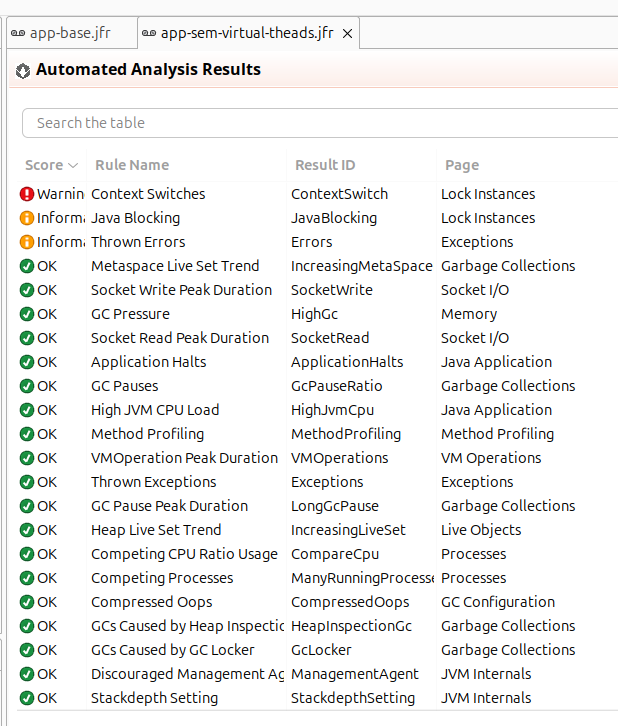
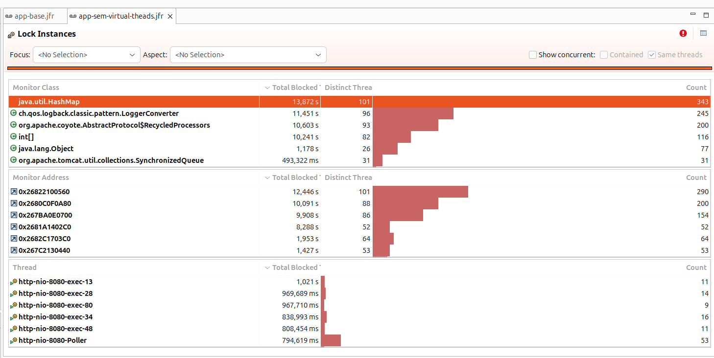
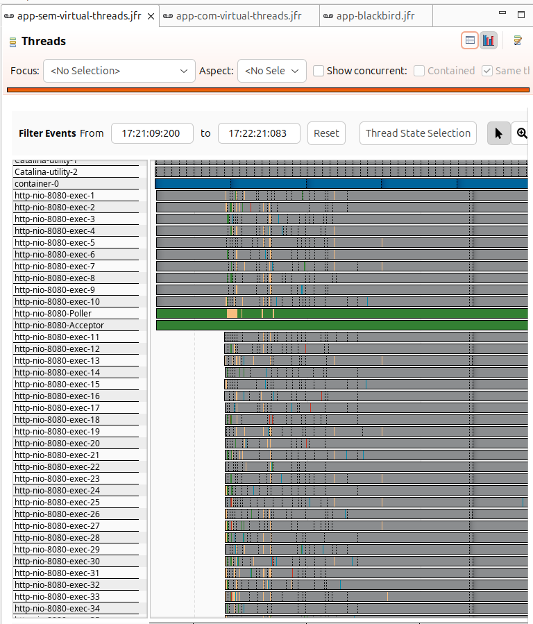
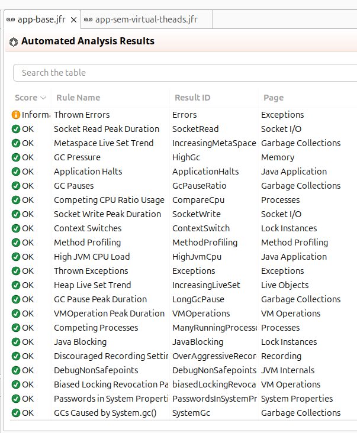
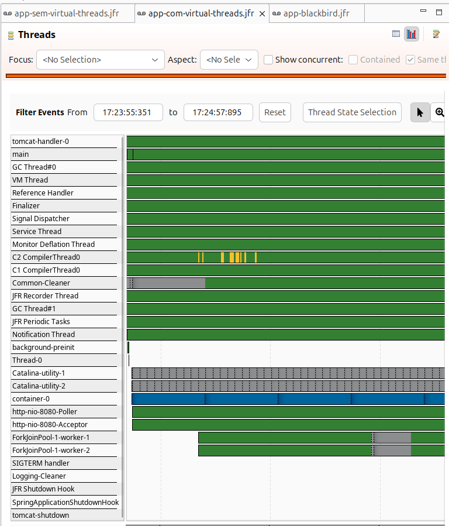

Cansado de pesquisar em vários lugares, em várias documentações, em vídeos, em becos e vielas, sobre como eu deveria 
configurar minhas aplicações e, no final, esquecendo de tudo que aprendi, forçando a repetir o mesmo enfadonho caminho,
tal qual Sisífio. Aqui estou eu, escrevendo esse blog, para ser o local do absoluto conhecimento para dar fim
a essa lástima.

Meu objetivo aqui é:
- Criar uma aplicação Spring MVC que esteja pronta para produção.
- Utilizar os melhores recursos disponíveis na JVM.
- Utilizar os melhores recursos disponíveis do Spring.
- Utilizar os melhores recursos disponíveis do Kubernetes e Docker.
- Não utilizar nada macabro, nada mirabolante, nada que você não veria em uma aplicação em produção.

<!-- truncate -->

## Projeto

### Ferramentas utilizadas

- Intellij IDEA
- Docker
- Kubernetes (k3s, distro local)
- JMC (Java Mission Control)
- Grafana K6 (para testes de carga)

### A aplicação

Para criar a aplicação utilizarei o [Spring Start/Initializr](https://start.spring.io/). A aplicação contém as seguintes
configurações:

- Kotlin e Gradle Kotlin (O tutorial não se prende a linguagem, com Java o fluxo é o mesmo).
- Spring Boot versão: 3.5.4.
- Java 21 LTS.
- Dependências do Spring: DevTools, Configuration processor, Actuator, Web, Prometheus (apenas uma preferência minha) e
  Validation.

O código é bem simples, temos um controller que aceita um body e retorna o mesmo objeto alterando o valor do titulo.
No meio dessa operação temos um log que serializa e exibe o valor do body recebido.

Este projeto tem um repositório próprio onde você poderá consultar o resultado e
testá-lo: [link do repo](https://github.com/ErickLemos/ultimoguia).

### Teste de carga utilizado

O teste de carga utilizado para medir o desempenho da aplicação consiste em dez rajadas de 100 mil requisições com o
intervalo de cinco segundos entre cada uma. O objetivo é:

- verificar a capacidade de como cada solução se comporta em um ambiente de estresse.
- Verificar como o GC se comporta.
- Verificar como o JIT se comporta.

Podemos notar um padrão ao aplicar esse teste, da primeira a terceira tentativa, a aplicação visivelmente está em
processo
de otimização do JIT. Após a quarta tentativa o comportamento é normalizado e o resultado fica estável, com pouquíssimas
variações.

## Configurando o gradle

### gradle.properties

Primeiro passo aqui será configurar nossa ferramenta de build. Primeiro passo é criar nosso arquivo de configuração
**gradle.properties** e nele que vamos adicionar as seguintes propriedades:

```text
org.gradle.parallel=true
org.gradle.daemon=true
org.gradle.caching=true
org.gradle.configuration-cache=true
org.gradle.jvmargs=-Xmx2048M
```
1. para habilitar o build paralelo.
2. para habilitar o daemon (útil no desenvolvimento). 
3. para habilitar o caching.
4. para habilitar o configuration caching.
5. para alterar o uso de mémoria (por padrão, 512MB).

### gradle.build

Agora vamos pular para o gradle build:

```kotlin
tasks.withType<Test>().configureEach {
    maxParallelForks = (Runtime.getRuntime().availableProcessors() / 2).coerceAtLeast(1)
}

tasks.withType<JavaCompile>().configureEach {
    options.isFork = true
}
```
1. habilitar o teste paralelo (recomendo colocar a metade de quantidade de core disponíveis, caso contrário seu pc vai gritar kk).
2. usar o compilador em um processo separado.

## Configurando container e a JVM

### Dockerfile e CDS

Para a construção do container, vou utilizar o exemplo da [documentação oficial do spring](https://docs.spring.io/spring-boot/reference/packaging/container-images/dockerfiles.html#packaging.container-images.dockerfiles.cds).
Aqui temos alguns recursos bem interessantes sendo utilizados, como a otimização em camadas para melhorar a eficiência
do docker e o uso do Class Data Sharing para melhorar o tempo de inicialização da aplicação. O resultado ficou assim:

```dockerfile
FROM gradle AS builder
WORKDIR /builder

COPY build.gradle.kts settings.gradle.kts ./
COPY gradle ./gradle
RUN gradle dependencies --no-daemon

COPY . .
RUN gradle build --no-daemon

FROM bellsoft/liberica-runtime-container:jdk-all-21-cds-musl AS builder-cds
WORKDIR /builder
COPY --from=builder /builder/build/libs/ultimoguia-1.0.jar application.jar
RUN java -Djarmode=tools -jar application.jar extract --layers --destination extracted

FROM bellsoft/liberica-runtime-container:jdk-21-cds-musl
WORKDIR /application
EXPOSE 8080

COPY --from=builder-cds /builder/extracted/dependencies/ ./
COPY --from=builder-cds /builder/extracted/spring-boot-loader/ ./
COPY --from=builder-cds /builder/extracted/snapshot-dependencies/ ./
COPY --from=builder-cds /builder/extracted/application/ ./

RUN java -XX:ArchiveClassesAtExit=application.jsa -Dspring.context.exit=onRefresh -jar application.jar
ENTRYPOINT [ \
    "java", \
    "-XX:SharedArchiveFile=application.jsa", \
    "-jar", \
    "application.jar" \
]
```

:::info BENCHMARK: Class Data Sharing

Tempo total que a aplicação demora para inicializar totalmente (chegar no estado READY):

| Tentativas | Java 21 | Java 21 + CDS |
|------------|---------|---------------|
| Primeira   | 1.265s  | 0.803s        | 
| Segunda    | 1.351s  | 0.859s        | 
| Terceira   | 1.438s  | 0.723s        | 

:::

:::tip AOT Cache

A partir do Java 24+ teremos novo cache, o AOT Cache! Fica de olho nessa próxima alternativa.

:::

:::tip Lazy Initialization

Você também pode habilitar o modo lazy do spring para carregar os beans de forma preguiçosa, pode ser útil em grandes
projetos:
```text
spring.main.lazy-initialization=true
```

:::

:::tip JVM minificada com Jlink

Outro recurso muito interessante do Java é a possibilidade de criar uma JVM Minificada utilizando o Jlink.

:::

### Memória

Em ambientes conteinerizados devemos definir a quantidade de uso da mémoria, caso contrário o processo de [ergonômia do Java](https://docs.oracle.com/en/java/javase/21/gctuning/ergonomics.html)
irá utilizar apenas 1/4 da memória total disponível. Podemos ajustar utilizando o parâmetro:

```text
-XX:MaxRAMPercentage=70
```

```dockerfile
# Dockerfile
ENTRYPOINT [ \
    "java", \
    "-XX:MaxRAMPercentage=70", \
    "-XX:SharedArchiveFile=application.jsa", \
    "-jar", \
    "application.jar" \
]
```

### Coletor de lixo

Outro ponto de atenção é o coletor de lixo, nem sempre o coletor que será selecionado automáticamente é o melhor para
nossa aplicação, veja como cada um se saiu no teste de carga na aplicação:

|             | Tempo total (reqs) | Quantidade de coletas | Duração média de coletas | Tempo total em coletas |
|-------------|--------------------|-----------------------|--------------------------|------------------------|
| Serial GC   | 00m02.6s           | 416                   | 1,090ms                  | 453,498ms              |
| Parallel GC | 00m01.9s           | 252                   | 1,033ms                  | 260,314ms              |
| G1GC        | 00m01.9s           | 137                   | 1,688ms                  | 231,283ms              |

Como já era de se esperar, G1GC saiu na frente dos demais. Também temos outros coletores como ZGC, Shenandoah e o C4 da 
Azul. Porém, vou desconsiderar para esta aplicação por conta das suas especifidades de uso, fica para um experimento futuro.

```dockerfile
# Dockerfile
ENTRYPOINT [ \
    "java", \
    "-XX:+UseG1GC", \
    "-XX:MaxRAMPercentage=70", \
    "-XX:SharedArchiveFile=application.jsa", \
    "-jar", \
    "application.jar" \
]
```

### Fine-tuning

Em desenvolvimento...

## Configurando o Spring

### Modo de desligamento

O spring possui duas formas de desligamento: immediate e graceful. Mas o que muda entre eles?

- immediate: quando a aplicação recebe o sinal de solicitação de desligamento (SIGTERM) pelo docker ou kubernetes, ela 
  irá desligar-se imediatamente. Esse comportamento pode ser prejudicial para requisições que estariam sendo processadas
  naquele momento.
- graceful: quando a aplicação recebe o sinal de desligamento, ela, primeiro irá deixar de receber novas requisições (isso
  será realizado pelo readiness probe), segundo ela terminará todas as requisições pendentes e então, por fim, irá desligar.

Com isso, fica obvio qual modo nós gostaríamos de ter, certo? Para habilitar o modo graceful, utilize:

```text
server.shutdown=graceful
```

:::danger MAS O SPRING JÁ NÃO FAZ ISSO POR PADRÃO?

O valor padrão pode variar dependendo da sua versão (2.x - immediate e 3.x - graceful), para evitar qualquer imprevisto
apenas altere o valor e durma bem as próximas noites.

:::

### Virtual Threads

Um excelente recurso que chegou no Spring Boot 3+ são os **virtual threads**. Além de melhorar o desempenho da aplicação, 
também temos um melhor aproveitamento do uso dos threads, diminuição de context switches e blocks.

Problemas vistos sem virtual threads:




Habilitando os virtual threads:




:::warning Cuidado: Pinning de CPU

Pinning de CPU é um problema que ocorre quando o virtual thread monopoliza o thread de plataforma (carrier). Há algumas 
causas comuns para esse problema: o uso de synchronized e métodos nativos (JNI). Caso não tenha notado nenhum benéficio 
ao habilitar os virtual threads, confira se você não está sofrendo com esse problema.

:::

### Configurando observabilidade

Nosso principal aliada na missão de atingir uma boa observabilidade será o actuator, então já prepara sua dependência:
````text
implementation("org.springframework.boot:spring-boot-starter-actuator")
````

Eu também configurei os seguintes componentes para nosso ambiente de teste:
- Otel Collector
- Prometheus - como servidor de métricas
- Zipkin - como servidor de tracing

Utilizarei o exporters do micrometer para enviar esses dados diretamente para o Otel Collector:

```text
implementation("io.micrometer:micrometer-registry-otlp")
```

E no arquivo de properties vamos adicionar as seguintes propriedades:
```text
management.otlp.metrics.export.url=${OTEL_EXPORTER_OTLP_ENDPOINT:http://localhost:4318}/v1/metrics
```
- OTEL_EXPORTER_OTLP_ENDPOINT: url do Otel Collector, no meu caso estarei utilizando o localhost

:::tip Outra alternativa: OpenTelemetry Agent

Utilizar o exporter do micrometer é uma das formas de garantir a comunicação com o Otel Collector, mas você também pode
optar por utilizar o OpenTelemetry Agent.

Ele possui suporte nativo ao Actuator/Micrometer, basta adicionar a propriedade no seu ENTRYPOINT:

```text
-Dotel.instrumentation.micrometer.enabled=true
```

Que ele automaticamente irá injetar uma implementação da classe MeterRegistry no seu projeto. Nenhuma outra configuração
será necessária e nem será preciso utilizar dependências "exporters".

:::

#### healthcheck
Podemos habilitar o endpoint de healthcheck com a seguinte propriedade:
```text
management.endpoints.web.exposure.include=health
```

E caso esteja utilizando o Kubernetes ou algum mecanismo que utilize os probes [liveness e readiness](https://kubernetes.io/docs/tasks/configure-pod-container/configure-liveness-readiness-startup-probes/), podemos habilitar esses
probes com a propriedade:
```text
management.endpoint.health.probes.enabled=true
```

Agora é só alterar o manifesto do kubernetes para utilizar os probes:
```yaml
livenessProbe:
  httpGet:
    port: 8080
    path: "/actuator/health/liveness"
readinessProbe:
  httpGet:
    port: 8080
    path: "/actuator/health/readiness"                              
```

#### métricas

Por padrão o actuator já exporta uma tonelada de métricas relacionada a aplicações que você pode conferir [aqui](https://docs.spring.io/spring-boot/reference/actuator/metrics.html#actuator.metrics.supported).
Você também pode visualizar as métricas sendo consumidas no prometheus acessando a url: http://localhost:9090 (três pontinhos na barra de pesquisa -> explore metrics).

Também podemos criar métricas personalizadas utilizando o MeterRegistry:
```kotlin
// realize a injeção do MeterRegistry, algo como:
@Autowired
lateinit var meterRegistry: MeterRegistry

// e então a utilize:
meterRegistry.counter("notas_salvas").increment()
```

#### tracing

Aqui vamos precisar de mais dependências:
```text
implementation("io.micrometer:micrometer-tracing")
implementation("io.micrometer:micrometer-tracing-bridge-otel")
implementation("io.opentelemetry:opentelemetry-exporter-otlp")
```

Nos properties, configuramos a url do tracing:
```text
management.otlp.tracing.endpoint=${OTEL_EXPORTER_OTLP_ENDPOINT:http://localhost:4318}/v1/traces
```

Com esses dois pontos configurados a aplicação já deve exportar os dados para o Otel Collector. Você pode conferir a API
do [micrometer tracing para mais detalhes](https://docs.micrometer.io/tracing/reference/) (recomendo dar uma olhada na api orientada a aspecto).

#### logs

O primeiro passo para trabalharmos bem com os logs é estrutura-los com algum padrão, o spring possui suporte integrado a
três:
- elastic Common Schema (ECS)
- graylog Extended Log Format (GELF)
- logstash

Podemos adicionar valores fixos ao logs utilizando:
```text
logging.structured.json.add.application=${spring.application.name}
```

Alguns atributos serão incluídos automaticamente nos logs, exemplo:
- valores do MDC.
- traceId, caso utilize o Micrometer.
- e spanId, caso utilize o Micrometer.

#### auditoria

Também temos um mecanismo de [auditoria integrado no spring](https://docs.spring.io/spring-boot/reference/actuator/auditing.html).
Ele será usado por padrão quando utilizarmos o Spring Data Auditing e o Spring Security.

Mas nesse caso precisamos realizar a implementação da interface AuditEventRepository, caso contrário ele irá utilizar o 
InMemoryAuditEventRepository que é bastante limitado.

Aqui um exemplo de uma implementação irreal (normalmente você irá desejar armazenar essas informações em um banco de dados):
```kotlin
@Component
class AuditEventRepositoryImpl : AuditEventRepository {
    companion object {
        private val log: Logger = LoggerFactory.getLogger(this::class.java)
    }
    class NotaAuditEvent(type: String) : AuditEvent("", type, mapOf<String, Any>())

    override fun add(event: AuditEvent) {
        log.info("Adding audit event: $event")
    }

    override fun find(
        principal: String?,
        after: Instant?,
        type: String?
    ): List<AuditEvent?>? {
        log.info("Finding audit events for principal: $principal, after: $after, type: $type")
        return listOf(NotaAuditEvent(type ?: "NOTA_SALVA"))
    }
}
```

### Otimizando a serialização com Jackson BlackBird

Jackson esconde alguns segredos (e eu n[liveness e readiness](https://kubernetes.io/docs/tasks/configure-pod-container/configure-liveness-readiness-startup-probes/)ão entendo o pq), adiciona o blackbird no projeto, descemos o tempo de conclusão
de
1.9s para fixos 1.6s segundos, a taxa de respostas reportadas pelo K6 também são animadoras:
sem o blackbird: iterações: 53792
com o blackbird: iterações: 58294

gradle.txt

```text
implementation("com.fasterxml.jackson.module:jackson-module-blackbird")
```

classe de configuração:

````kotlin
@Configuration
class ObjectMapperConfigCustomizer : Jackson2ObjectMapperBuilderCustomizer {

    override fun customize(jacksonObjectMapperBuilder: Jackson2ObjectMapperBuilder) {
        jacksonObjectMapperBuilder.modulesToInstall(BlackbirdModule())
    }

}
````

## Configurando banco de dados

Em desenvolvimento...

## Configurando segurança: Oauth2

Em desenvolvimento...

## Configurando filas

Em desenvolvimento...

## Configurando jobs e scheduled tasks

Em desenvolvimento...

## Configurando cache

Em desenvolvimento...

## Configurando comunicação entre serviços

Em desenvolvimento...

## Resiliência

Em desenvolvimento...

## Experimentando

Em desenvolvimento...

