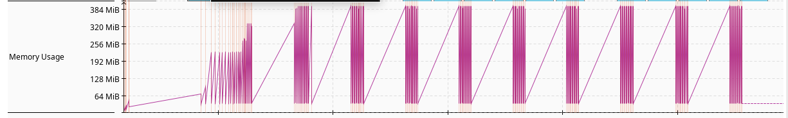
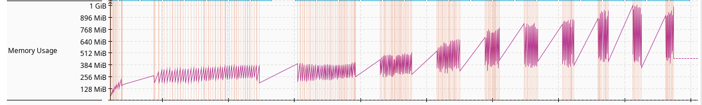

Este guia tem como função ser a minha e a sua principal fonte de verdade para futuras configurações que você precise
trabalhar.

O foco deste tutorial é:

- Utilizar os melhores recursos disponíveis na JVM, em geral(GC Fine-tuning, NUMA, CDS, etc).
- Utilizar os melhores recursos disponíveis do Spring.
- Utilizar os melhores recursos disponíveis do Kubernetes e Docker.
- Ter um bom nível de observabilidade, com foco em ambientes de produção.
- Ter um bom desempenho (resultado dos testes inclusos).

<!-- truncate -->

## Projeto

### Ferramentas utilizadas

- Intellij IDEA
- Docker
- Kubernetes (k3s, distro local)
- JMC (Java Mission Control)
- Grafana K6 (para testes de carga)

### A aplicação

Para criar a aplicação utilizarei o [Spring Start/Initializr](https://start.spring.io/). A aplicação contém as seguintes
configurações:

- Kotlin e Gradle Kotlin (O tutorial não se prende a linguagem, com Java o fluxo é o mesmo).
- Spring Boot versão: 3.5.4.
- Java 21 LTS.
- Dependências do Spring: DevTools, Configuration processor, Actuator, Web, Prometheus (apenas uma preferência minha) e
  Validation.

O código é bem simples, temos um controller que aceita um body e retorna o mesmo objeto alterando o valor do titulo.
No meio dessa operação temos um log que serializa e exibe o valor do body recebido.

Este projeto tem um repositório próprio onde você poderá consultar o resultado e
testá-lo: [link do repo](http://google.com).

### Teste de carga utilizado

O teste de carga utilizado para medir o desempenho da aplicação consiste em dez rajadas de 100 mil requisições com o
intervalo de cinco segundos entre cada uma. O objetivo é:

- verificar a capacidade de como cada solução se comporta em um ambiente de estresse.
- Verificar como o GC se comporta.
- Verificar como o JIT se comporta.

Podemos notar um padrão ao aplicar esse teste, da primeira a terceira tentativa, a aplicação visivelmente está em
processo
de otimização do JIT. Após a quarta tentativa o comportamento é normalizado e o resultado fica estável, com pouquíssimas
variações.

## Configurando container e a JVM

### Dockerfile e CDS

Vou utilizar
a [documentação oficial do spring sobre imagens docker](https://docs.spring.io/spring-boot/reference/packaging/container-images/dockerfiles.html#packaging.container-images.dockerfiles.cds)
para configurar nosso Dockerfile com o cache CDS(Class
Data Sharing) habilitado, isso vai ajudar a termos mais desempenho na inicialização da aplicação. O resultado fica mais
ou menos assim:

```dockerfile
FROM gradle AS builder
WORKDIR /builder

COPY build.gradle.kts settings.gradle.kts ./
COPY gradle ./gradle
RUN gradle dependencies --no-daemon

COPY . .
RUN gradle build --no-daemon

FROM bellsoft/liberica-runtime-container:jdk-all-21-cds-musl AS builder-cds
WORKDIR /builder
COPY --from=builder /builder/build/libs/ultimoguia-1.0.jar application.jar
RUN java -Djarmode=tools -jar application.jar extract --layers --destination extracted

FROM bellsoft/liberica-runtime-container:jdk-21-cds-musl
WORKDIR /application
EXPOSE 8080

COPY --from=builder-cds /builder/extracted/dependencies/ ./
COPY --from=builder-cds /builder/extracted/spring-boot-loader/ ./
COPY --from=builder-cds /builder/extracted/snapshot-dependencies/ ./
COPY --from=builder-cds /builder/extracted/application/ ./

RUN java -XX:ArchiveClassesAtExit=application.jsa -Dspring.context.exit=onRefresh -jar application.jar
ENTRYPOINT [ \
    "java", \
    "-XX:+UseG1GC", \
    "-XX:MaxRAMPercentage=70", \
    "-XX:SharedArchiveFile=application.jsa", \
    "-jar", \
    "application.jar" \
]
```

:::tip AOT Cache

Caso esteja utilizando Java 24+, dê preferência a utilização do AOT Cache no lugar o CDS, mas também é possível utilizar
os dois ao mesmo tempo.

:::

:::info BENCHMARK: Class Data Sharing

Tempo total que a aplicação demora para inicializar totalmente (chegar no estado READY):

| Tentativas | Java 21 | Java 21 + CDS |
|------------|---------|---------------|
| Primeira   | 1.265s  | 0.803s        | 
| Segunda    | 1.351s  | 0.859s        | 
| Terceira   | 1.438s  | 0.723s        | 


Temos um ganho médio de mais ou menos 58% nesses casos.

:::

:::warning EXPERIMENTO: CDS + Lazy inicialization

Também testei como funciona o lazy mode do spring (spring.main.lazy-initialization=true), porém o resultado não mudou
muito, girando em torno de 906ms para inicializar. Sem CDS e com lazy ele chegou
a 1.405s.

Na teoria esse modo deveria melhorar considerávelmente a inicialização da aplicação, mas nos meus testes essa mudança
não foi notada, muito provavelmente isso ocorre pelo tamanho da minha aplicação de exemplo.

:::

:::warning EXPERIMENTO: JVM minificada com Jlink

Utilizar o Jlink para criação de um JVM minificada. Não houve grande diferença no desempenho final de inicialização.

:::

### Memória

Por padrão a JVM vai utilizar apenas 2/5 da memoria total disponível, para ambientes containizados isso não é benefico.
Podemos alterar esse valor com o parametro:

```text
-XX:MaxRAMPercentage=70
```

resultado:
```dockerfile
ENTRYPOINT [ \
    "java", \
    "-XX:MaxRAMPercentage=70", \
    "-XX:SharedArchiveFile=application.jsa", \
    "-jar", \
    "application.jar" \
]
```

### Coletor de lixo

Vamos dar uma olhada em como cada coletor de lixo sai:

|             | Tempo total (reqs) | Quantidade de coletas | Duração média de coletas | Tempo total em coletas |
|-------------|--------------------|-----------------------|--------------------------|------------------------|
| Serial GC   | 00m02.6s           | 416                   | 1,090ms                  | 453,498ms              |
| Parallel GC | 00m01.9s           | 252                   | 1,033ms                  | 260,314ms              |
| G1GC        | 00m01.9s           | 137                   | 1,688ms                  | 231,283ms              |

Como já era de se esperar, G1GC se deu muito melhor nos testes do que os demais, por esse motivo, vou dar continuidade
utilizando-o.

resultado:
```dockerfile
ENTRYPOINT [ \
    "java", \
    "-XX:+UseG1GC", \
    "-XX:MaxRAMPercentage=70", \
    "-XX:SharedArchiveFile=application.jsa", \
    "-jar", \
    "application.jar" \
]
```

## Configurando o Spring

### Configurando healthcheck

Por padrão o Spring configura o seu path de healthcheck de forma mista (/actuator/health), é útil para usos simples,
porém podemos extrair um pouco mais dessa função habilitandoloc os additional
probes ([liveness e readiness](https://kubernetes.io/docs/tasks/configure-pod-container/configure-liveness-readiness-startup-probes/)):

```text
management.endpoints.web.exposure.include=health,info,prometheus
management.endpoint.health.probes.enabled=true
```

Agora temos os novos probes para utilizarmos no kubernetes:

- readiness: /actuator/health/readiness
- liveness: /actuator/health/liveness

Podemos utilizá-los no kubernetes da seguinte forma:

```yaml
livenessProbe:
  httpGet:
    port: 8080
    path: "/actuator/health/liveness"
  initialDelaySeconds: 1
  failureThreshold: 3
  periodSeconds: 3
  timeoutSeconds: 3
readinessProbe:
  httpGet:
    port: 8080
    path: "/actuator/health/readiness"
  initialDelaySeconds: 1
  failureThreshold: 3
  periodSeconds: 1
  timeoutSeconds: 1                              
```

### Modo de desligamento

Existem duas formas de desligamento: immediate e graceful. Mas o que ocorre em cada um deles?

- immediate: quando a aplicação recebe o sinal para desligar pelo docker ou kubernetes ela irá desligar-se imediatamente
  (obviamente), esse comportamento pode ser prejudicial, já que requisições que estariam sendo processadas nesse momento
  irão ser encerradas.
- graceful: quando a aplicação receber o sinal para desligar pelo docker ou kubernetes ela primeiro irá parar de receber
  novas requisições (importante ter os probes liveness/readiness habilitados), termina todos as requisições pendentes
  e então após isso ela desligar, tendo um comportamento mais resiliente.

Para habilitar o modo graceful, utilize:

```text
server.shutdown=graceful
```

:::danger MAS O SPRING JÁ NÃO FAZ ISSO POR PADRÃO?

O valor padrão pode variar dependendo da sua versão (2.x - immediate e 3.x - graceful), para evitar qualquer imprevisto
apenas altere o valor e durma bem as próximas noites.

:::

### Virtual Threads

Um excelente recurso do Spring Boot 3 são os virtual threads. Há uma boa promessa que eles podem nos ajudar em ambientes
de grande throughput. No teste atual não houve diferença algum no resultado, mas houve uma quantidade consideravelmente
menor
de context switches, muito provavelmente pela forma com que o spring começou a gerenciar os theads, veja só:


Para conseguir notar a diferença eu aumentei a quantidade de requisições, de 100 mil para um milhão!

Novamente temos um quantidade bastante inferior de context switches, e o desempenho entre com e sem os virtual threads
fica:
sem - 00m18.8s
com - 00m18.3s

Por conta da diferença dos contexts switches, vou seguir com a esta opção habilitada. Nosso checkpoint até o momento é
que nossa
aplicação está processando o teste em cerca de 00m01.9s.

:::warning CALLABLE + Virtual Threads

Outra alternativa de paralelização é a utilização do Callable nos Controllers, porém utilizar-lo junto com o virtual
thread
não resultou em nenhuma mudança significativa no resultado final, nem em coletas ou qualquer mecanismo interno da JVM.

:::

### Configurando observabilidade

#### métricas

#### tracing

#### logs

#### auditoria

#### http exchange

### Otimizando a serialização com Jackson BlackBird

Jackson esconde alguns segredos (e eu não entendo o pq), adiciona o blackbird no projeto, descemos o tempo de conclusão
de
1.9s para fixos 1.6s segundos, a taxa de respostas reportadas pelo K6 também são animadoras:
sem o blackbird: iterações: 53792
com o blackbird: iterações: 58294

gradle.txt

```text
implementation("com.fasterxml.jackson.module:jackson-module-blackbird")
```

classe de configuração:

````kotlin
@Configuration
class ObjectMapperConfigCustomizer : Jackson2ObjectMapperBuilderCustomizer {

    override fun customize(jacksonObjectMapperBuilder: Jackson2ObjectMapperBuilder) {
        jacksonObjectMapperBuilder.modulesToInstall(BlackbirdModule())
    }

}
````

### Customizações

#### Banner

#### Build Info

## Experimentos

### AzulJdk Prime

queda de desempenho, o resultado final ficou em 00m02.2s. Houve também um aumento considerável de uso de
memoria (bateu 1GB que uso total, o nosso teste base até o momento estava em cerca de 400MB).



### Spring Webflux

aumento de desempenho, o teste foi concluido em 00m01.6sm, sempre mantendo a média de iterações superiores a
60 mil (ultimo teste apresentou 61258 mil iterações), antes a aplicação estava entre 56 a 58 mil.

### Experimento falho: aumentar o NewRatio

definir o -XX:NewRatio=1, teoricamente isso deveria funcionar bem, mas neste exemplo não houve diferença alguma na
solução com ou sem.

### Experimento falho: trocar de embedded server

alterar o servidor para jetty ou undertown, teoricamente aqui também deveria sofrer um bom aumento, mas na pratica isso
não mudou nada.

### Experimento falho: Alterar o tempo médio de pausa do GC

Alterar o -XX:MaxGCPauseTimeMillis=MILISEGUNDOS entre 100ms e 300ms, não houve mudança significativa no resultado final
e nem na latência das requisições.

### Experimento falho: Aumentar o ForkJoin Pool do Spring (virtual threads)

Aumentar o tamanho do ForkJoin Pool do Spring (virtual threads) para 5 e para 10, não houve mudança nenhuma, apenas mal
utilização dos recursos e alguns bloqueio: Monitor Class Total Blocked Time Maximum Blocked Time Average Blocked Time
Std Dev Blocked Time Distinct Threads Count Distinct Addresses
org.apache.coyote.AbstractProtocol$RecycledProcessors

### Experimento falho: NUMA

Habilitar o NUMA fez com que a aplicação diminuisse seu desempenho.

### Experimento falho: Callable Async Request

Utilizar o Callable Async Request junto ao Virtual threads diminuiu o desempenho da aplicação, resultado final:
00m02.5s.

### Experimento: CRAC

- Spring Native MVC: em andamento...
- Spring Native Webflux: em andamento...