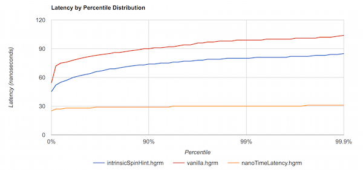

# Dicas gerais e armadilhas

---

## Sempre atualize a sua versão LTS

Diferente de que muitos desenvolvedores acreditam, atualizar a versão da sua JVM é muito mais do que adicionar mais
recursos
no nível de linguagem para facilitar o desenvolvimento. Apesar da linguagem caminhar a passos lentos na adoção de novos
recursos, isso não é verdade para a JVM, cada release traz uma enxurrada de otimizações e novos recursos que muitas
vezes
não vão ser descritos em artigos que encontramos por aí na internet.

Se que melhorar o desempenho da sua aplicação, atualize a versão!
Será o caminho mais curto e fácil que pode optar.

:::tip exemplo - Java 9 e instruções PAUSE

Java 9 foi a primeira versão a receber o [JEP 285](https://openjdk.org/jeps/285), que visa melhorar o polling
ativo dos threads, cenário onde um thread bloqueia um recurso e as outras threads ficam esperando sua vez, levando essas
mesmas threads realizar uma pesquisa continua para verificar se a sua vez chegou. O problema é que essa pesquisa acaba
consumindo recursos de CPU e energia.

Para resolver esse problema foi utilizado como base a nova instrução PAUSE introduzida pela intel
no [SSE2](https://www.intel.com/content/www/us/en/support/articles/000005779/processors.html),
permitindo então que a JVM a invocasse diretamente.



:::

---

## Context Switch e seu impacto na performance

Um thread precisa ser vinculado a uma CPU, mas esse vínculo não é permanente, podendo ser transferido para outra CPU
quando necessário (ação essa que o S.O é responsável). 
Esse processo é chamado de Context Switch, e você constantemente ouvirá sobre ele como algo ruim apesar de estar envolvido
no mecanismo de distribuição de carga.

Aqui alguns motivos dessa má fama:

- Toda vez que um context switch ocorre o thread precisa ser salvo e restaurado na nova CPU em que foi agendado, esse 
processo por si só não é de graça.


- Além do custo da troca de CPU, há também a invalidação de algumas camadas de cache, tornando a execução inicial mais lenta
por conta da enxurrada de falhas que as consultas de cache sofrerá. 

- Esse processo é tão problemático que os sistemas operacionais possuem um tempo mínimo que um thread fica vinculado a um
  CPU na tentativa de compensar os danos que o context switch causa. Mas o próprio tempo mínimo pode se tornar uma armadilha
  em um cenário onde há vários threads brigando por tempo da CPU. 

- Não bastando a queda, vem o coice! Quando as vulnerabilidades Meltdown e Spectre foram corrigidas, foi também anunciado
  que as CPUs perderiam uma certa quantidade considerável de poder computacional. Adivinha quem é o culpado? Isso! 
  Infelizmente a correção afetou diretamente o processo de context switch, tornando-o ainda mais pesado! 
  [Veja mais detalhes](https://www.techrepublic.com/article/spectre-and-meltdown-explained-a-comprehensive-guide-for-professionals/).

Compreender o evento do context switch é de extrema importância quando estamos trabalhando em ambientes com muitas threads,
paralelismo e concorrência.

E é claro, podemos verificar a quantidade de context switch ocorrendo no nosso sistema utilizando:
```shell
vmstat 1
```

:::tip custo exato

Tomando como base o livro Java Concurrency in Practice (lançado em 2006), um context switch custa em média cinco a dez
mil ciclos da CPU.

:::

:::tip O truque da LMAX

Lidar tão bem com o context switch é um dos principais truques que estão por baixo do LMAX Disruptor.

:::

---

## WildCard imports e Sugar Syntax

Um assunto que divide opiniões no ecossistema Java, veja o seguinte trecho:

```kotlin

import org.example.api.*

```

Você considera-o menos performático? Algumas pessoas dirão que sim, afinal, estou importando tudo que está dentro do
pacote "api"! Porém, isso não é verdade, não há nada sendo importado aqui!

Java assim como outras linguagens possuem recursos estéticos chamados "Syntactic Sugars" ou "Sugar Syntax". Como o nome
aparenta, eles servem apenas para deixar o seu código mais bonito, **não causando nenhum impacto no desempenho da sua
aplicação.**

Isso apenas evita o desenvolvedor de escrever um syntax parecida com essa (também chamado de "nome totalmente 
qualificado"):

```kotlin
fun main(): org.example.api.ClasseInterna {
....
}
```

Podemos tirar a prova da inexistência dos imports analisando o bytecode da classe, para isso utilizamos o comando:
```shell
javap -p Constants.class
# e também
javap -c java.lang.Boolean
```

:::info IDES e seus métodos de importação

O método de importação pode variar de acordo com sua IDE:

- Intellij - sempre que possível utilizará wild cards. Há também a opção "optimize imports" na seção "code" que forçará
  wild imports e reorganizará as importações por ordem alfabética.
- Eclipse - detecta o caminho exato da classe e o importa sem utilizar wild cards.

:::

## Curiosidades

:::tip motivo do nome bytecode

O código de operação de máquina de pilha (opcode) é representado por um byte, por isso o nome bytecode.
Por esse mesmo motivo o conjunto total de operações permitidas são de apenas 255, que atualmente algo em torno de 200+
já estão em uso no Java 23.

:::